# README

# 🛒 Olist E-Commerce Dataset Analysis

**A full end-to-end SQL analytics project** - from raw CSVs to business insights across Gross Merchandise Value (GMV) & Order Volume, Delivery & Logistics, and Customer Satisfaction. The analysis was performed using the public [Olist Brazilian E-Commerce dataset](https://www.kaggle.com/datasets/olistbr/brazilian-ecommerce/data).

Key insights can be found at the end of each business question's section.

---

## 📖 Introduction

This was a full end-to-end project: designing a relational schema from raw CSVs, loading and cleaning the data, defining business questions from scratch, and writing SQL to answer them. I wanted to follow a similar workflow that a data analyst would with a messy, real-world dataset.

---

## 🧠 Key Skills Demonstrated

I built this project to sharpen both my technical SQL ability and my judgment as an analyst - defining my own business questions, thinking from a stakeholder’s perspective, and making (and documenting) the calls a real analyst has to make.

| Skill Area | What It Demonstrates |
| --- | --- |
| 🏗️ **Data modeling & schema design** | I built a normalised relational schema from raw CSVs, defined PKs/FKs, and reasoned through composite keys  |
| 🔧 **ETL / data engineering fundamentals** | I diagnosed and fixed load failures (encoding, line endings, invalid dates, wrong source files)  |
| 🎯 **Metric definition & business judgment** | I defined GMV precisely, decided what counts as a “repeat customer,” and excluded cancelled / unavailable orders from my GMV metric with documented rationale |
| 🔍 **Analytical rigor / avoiding false conclusions** | I used a floor-selection methodology to avoid noisy small-sample rankings, framed correlations as “associated with” rather than “causes,” and checked category sample sizes before presenting repeat customer findings. |
| 🐛 **Root-cause debugging** | I traced NULLs and bugs back to their actual causes instead of jumping to first guesses. |
| ⚡ **SQL-driven data analysis techniques** | I used CTEs for readable, layered logic; window functions (`LAG` for YoY growth, `NTILE` for price-quintile bucketing) for comparisons; derived tables/subqueries for aggregating an aggregate; and `HAVING`-based thresholds to stabilise rankings |

---

## 🚀 Project Overview

The goal of this project was to:

- 🎯 Define business questions I thought would uncover meaningful, stakeholder-relevant insights.
- 🏗️ Design and build a relational database for the Olist dataset in MySQL.
- 🔎 Perform exploratory data analysis (EDA) - to get a quick overview of product categories, review scores, order statuses, and more…
- 📈 Write business-driven SQL queries to derive insights across GMV & Order Volume, Delivery & Logistics, and Customer Satisfaction

---

## ❓ Business Questions

### 💰 GMV & Order Volume

1. How did Gross Merchandise Value (GMV) and Order Volume trend year-over-year?
2. Which product categories are driving that growth or decline?
3. Which regions are driving that growth or decline?

### 🚚 Delivery & Logistics

1. What does the order status breakdown look like across the dataset, and what share of orders are cancelled or unavailable?
2. Does the cancellation/unavailable rate vary by price or seller?
3. On average, how far off are actual delivery dates from the estimated delivery date?
4. Which sellers deliver fastest and slowest, among sellers with a meaningful order volume?
5. Do small or light orders pay disproportionately high freight relative to distance?

### ⭐ Customer Satisfaction

1. What does the distribution of review scores look like?
2. Are photo count and description length associated with review score, and which has the stronger relationship?
3. Are late deliveries associated with lower review scores?
4. What share of customers make a repeat purchase, and does that likelihood vary by customer state or by the category of their first purchase?

---

## 🗂️ Dataset Overview

- **Source:** [Olist Brazilian E-Commerce dataset on Kaggle](https://www.kaggle.com/datasets/olistbr/brazilian-ecommerce/data)
- **Tables used (8):**
    - `orders`
    - `order_items`
    - `order_payments`
    - `order_reviews`
    - `products`
    - `sellers`
    - `customers`
    - `product_category_name_translation`
- **Entity relationships:** Table relationships were defined using the schema context provided by Olist on Kaggle, then implemented as primary / foreign key constraints in MySQL.

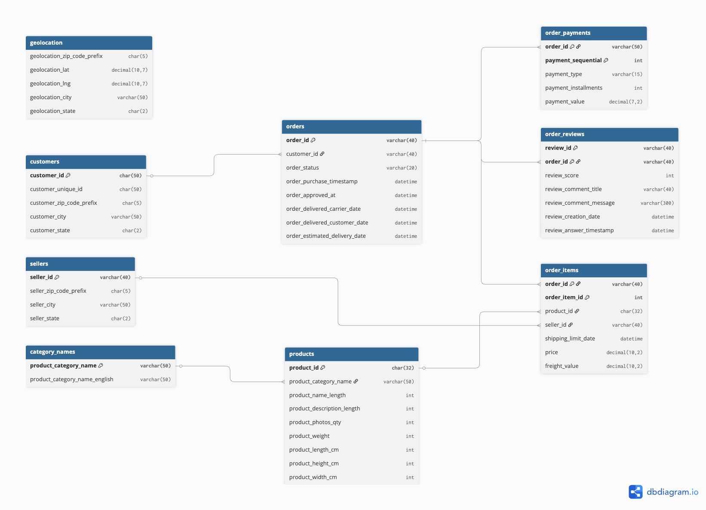

---

## 🔄 Project Workflow

1. 📥 Selected the Olist e-commerce dataset from Kaggle
2. 👀 Reviewed the raw tables in Excel to understand what data was available and what business questions it could answer
3. ❓ Defined the business questions most relevant to business stakeholders within ecommerce industry.
4. 🏗️ Set up the MySQL database using `CREATE TABLE` statements
5. ✅ Loaded and verified all 8 tables
6. 🔗 Designed and implemented schema relationships (PKs / FKs)
7. 🧮 Wrote analysis SQL across three sections: GMV & Order Volume, Delivery & Logistics, Customer Satisfaction
8. 💡 Analysed results and derived my insights

---

## 📁 Repository Structure

```
├── sql/                # Full, commented SQL scripts by section
│   ├── 01_database_setup.sql
│   ├── 02_data_loading.sql
│   ├── 03_GMV_order_volume_trends.sql
│   ├── 04_delivery_logistics.sql
│   └── 05_customer_satisfaction.sql
├── Images/              # ERD diagram and chart images
│   └── erd.png
├── README.md
```

---

## 💡 Key Findings & Insights

### 💰 GMV & Order Volume

#### Methodology

**Defining the core metric: GMV, not "revenue."** My first instinct was to call this metric "revenue." That's not accurate: `payment_value` in the `order_payments` table is the amount the *customer* paid, which mostly flows through to the *seller*. Olist's actual commission isn't captured anywhere in this dataset. So what I'm measuring is **Gross Merchandise Value (GMV)** - the total transaction value moving through the platform, not company revenue.

I then had to decide which orders to include. The standard definition nets GMV down by removing cancellations:

> GMV = total value of all orders placed → minus cancellations → Net GMV = value of orders that actually reached fulfillment.

In this dataset, `order_status` includes two categories that represent transactions which never became real, completed sales: `canceled` and `unavailable`. I excluded both from every GMV and order-count figure in this section, and use **Net GMV** as the term throughout (SQL aliases, comments, and this write-up are all consistent on this).

```sql
-- Total orders and total GMV attributed to each order status.
-- Used to decide which statuses to exclude from Net GMV.
SELECT o.order_status AS order_status,
       SUM(s.sum_payment_value) AS total_gmv,
       AVG(s.sum_payment_value) AS average_order_value,
       COUNT(*) AS total_orders
FROM ORDERS o
LEFT JOIN (
    SELECT order_id, SUM(payment_value) AS sum_payment_value
    FROM order_payments
    GROUP BY order_id
) s ON s.order_id = o.order_id
GROUP BY o.order_status;
```

| order status | total GMV (R$) | average order value (R$) | total orders |
| --- | --- | --- | --- |
| delivered | 15,422,461.77 | 159.86 | 96,478 |
| unavailable | 126,479.51 | 207.68 | 609 |
| shipped | 177,213.96 | 160.08 | 1,107 |
| canceled | 143,255.60 | 229.21 | 625 |
| invoiced | 69,137.99 | 220.18 | 314 |
| processing | 69,394.11 | 230.55 | 301 |
| approved | 241.08 | 120.54 | 2 |
| created | 688.10 | 137.62 | 5 |

**Note:** `canceled` and `unavailable` orders skew toward a *higher* average order value (R$229 and R$208) than the dataset average (R$161). This means excluding them isn't neutral: it disproportionately removes higher-ticket transactions.

Excluding those two statuses:

| | Value |
| --- | --- |
| Total GMV (unfiltered) | R$16,008,872.12 |
| Net GMV (canceled/unavailable excluded) | R$15,739,137.01 |
| Total orders (unfiltered) | 99,441 |
| Net orders | 98,207 |
| Net Average Order Value | R$160.27 |

**Choosing the comparison window.** Before running any year-over-year comparison, I checked the actual date range and distribution of the data to make sure I wasn't comparing incomparable periods.

```sql
-- Distribution of orders, net GMV, and average order value across every
-- year in the dataset (full calendar years, not like-for-like).
SELECT DATE_FORMAT(o.order_purchase_timestamp, '%Y') AS order_year,
       COUNT(*) AS net_orders,
       SUM(s.sum_payment_value) AS net_gmv,
       AVG(s.sum_payment_value) AS average_order_value
FROM ORDERS o
LEFT JOIN (
    SELECT order_id, SUM(payment_value) AS sum_payment_value
    FROM order_payments GROUP BY order_id
) s ON s.order_id = o.order_id
WHERE o.order_purchase_timestamp BETWEEN "2016-01-01" AND "2020-12-31"
  AND o.order_status NOT IN ('canceled', 'unavailable')
GROUP BY order_year
ORDER BY order_year;
```

| order year | net orders | net GMV | average order value |
| --- | --- | --- | --- |
| 2016 | 296 | R$51,813.38 | R$175.64 |
| 2017 | 44,379 | R$7,092,491.65 | R$159.82 |
| 2018 | 53,532 | R$8,594,831.98 | R$160.56 |

**2016 excluded** - 296 orders is not a comparable base to 44K–53K; including it would distort any trend line.

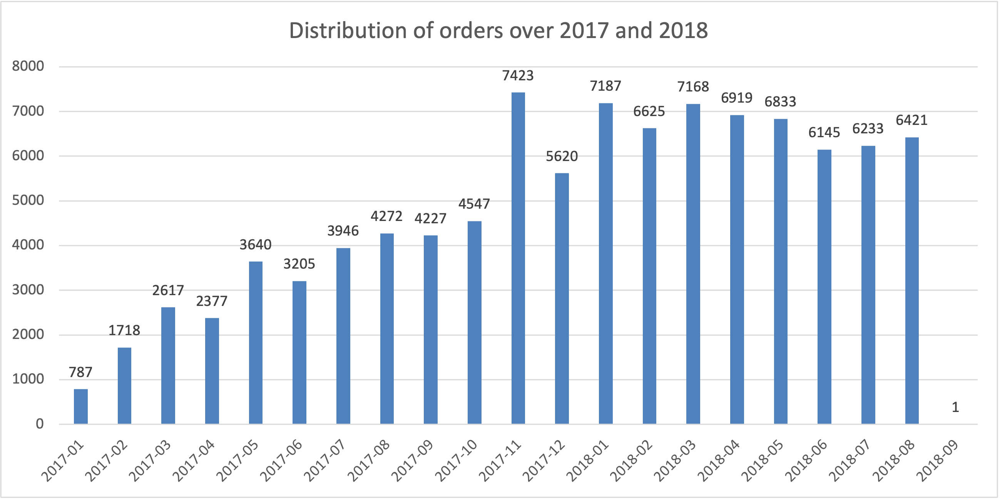

This chart shows a sharp drop-off after **2018-08** (2018-09 has a single order in the dataset), confirming 2018 is a partial year cut off mid-way. So every 2017-vs-2018 comparison below is restricted to **January–August, both years** - a like-for-like window, not a full-year one. This also means the 2017 total above (44,379 orders, full year) isn't the number used in comparisons; the Jan–Aug subset is:

| order year | net orders (Jan–Aug) | net GMV (Jan–Aug) | average_order_value |
| --- | --- | --- | --- |
| 2017 | 22,562 | R$3,575,957.46 | R$158.49 |
| 2018 | 53,531 | R$8,594,665.52 | R$160.55 |

**Context worth stating explicitly:** 2017 itself was on a steep growth trajectory that year (the platform was scaling up from a very small base), so any 2017→2018 growth % below is being measured off an already-fast-growing baseline — it should be read as "growth on top of growth," not a mature-platform comparison.

#### Monthly Trends: 2017 vs 2018 (Jan–Aug)

```sql
-- Monthly net GMV, 2017 comparative months (Jan-Aug)
SELECT DATE_FORMAT(o.order_purchase_timestamp, '%Y-%m') AS order_month,
       SUM(s.sum_payment_value) AS net_gmv
FROM ORDERS o
LEFT JOIN (
    SELECT order_id, SUM(payment_value) AS sum_payment_value
    FROM order_payments GROUP BY order_id
) s ON s.order_id = o.order_id
WHERE o.order_purchase_timestamp >= "2017-01-01" AND o.order_purchase_timestamp < "2017-09-01"
  AND o.order_status NOT IN ('canceled', 'unavailable')
GROUP BY order_month
ORDER BY order_month;
-- (Same query re-run for orders (COUNT) and AOV (AVG), and again for the
-- 2018 window — see sql/03_GMV_order_volume_trends.sql for the full set; not
-- reproduced here since the logic is identical.)
```

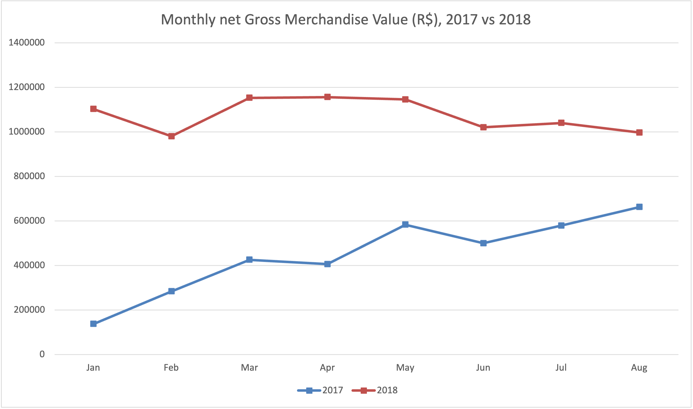

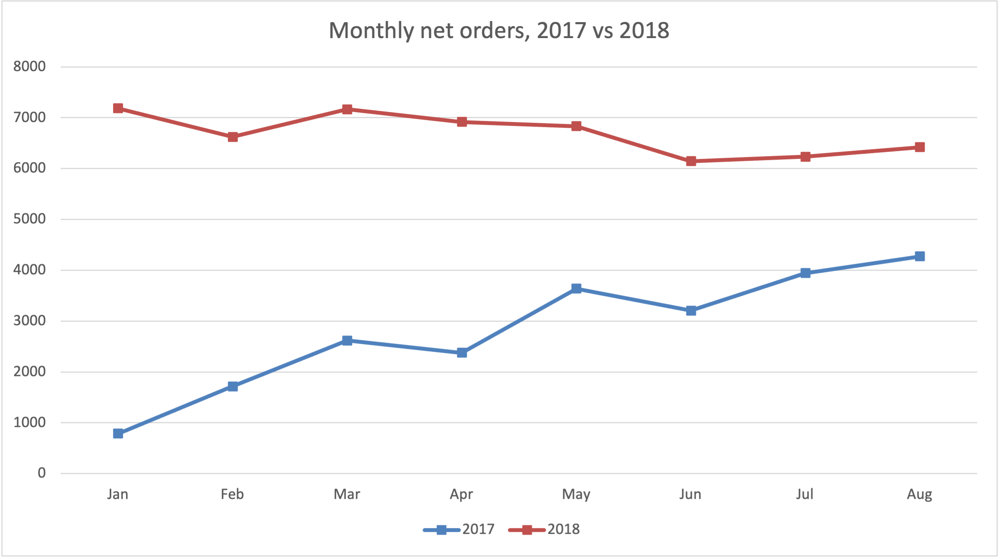

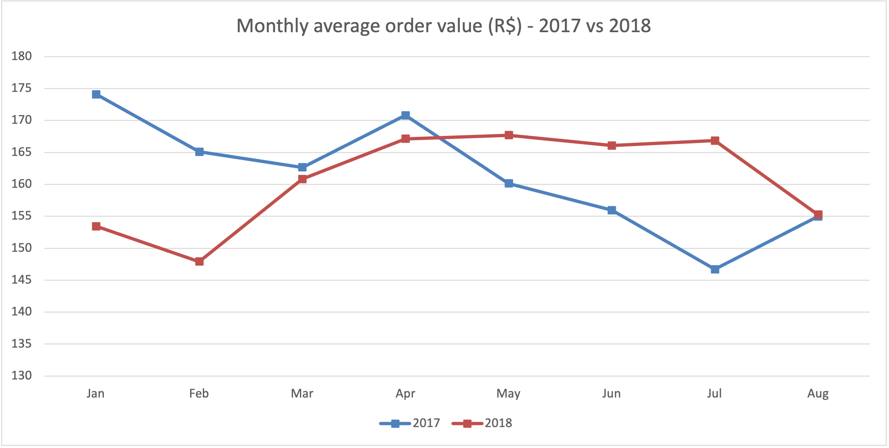

**Year-on-year growth**

```sql
-- Month-on-month order volume growth, 2017 vs 2018 (CTE + LAG window function).
-- LAG offset of 8 shifts back 8 months to align each 2018 month with its
-- same-month 2017 counterpart within the monthly_data CTE's row order.
-- Excludes canceled/unavailable orders.
WITH monthly_data AS (
  SELECT DATE_FORMAT(order_purchase_timestamp, '%Y-%m') AS order_month,
         COUNT(*) AS net_orders
  FROM ORDERS
  WHERE (order_purchase_timestamp BETWEEN "2017-01-01" AND "2017-09-01"
         OR order_purchase_timestamp BETWEEN "2018-01-01" AND "2018-09-01")
    AND order_status NOT IN ('canceled', 'unavailable')
  GROUP BY order_month
  ORDER BY order_month
), filtered_monthly_data AS (
  SELECT order_month, net_orders,
         LAG(net_orders, 8) OVER (ORDER BY order_month) AS net_orders_previous_year
  FROM monthly_data
)
SELECT order_month, net_orders, net_orders_previous_year,
       ((net_orders - net_orders_previous_year) / net_orders_previous_year) * 100 AS orders_growth_percentage
FROM filtered_monthly_data
WHERE order_month LIKE '2018%';
-- (GMV and AOV growth use the identical CTE/LAG pattern on their
-- respective metrics — see sql/03_GMV_order_volume_trends.sql.)
```

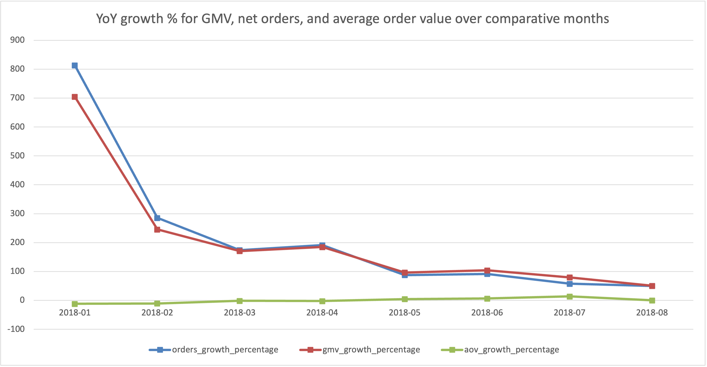

#### Category Analysis

```sql
-- Top 10 product categories by order count, 2017 comparative months (Jan-Aug)
SELECT product_category_name_english, COUNT(*) AS net_orders
FROM (
    SELECT oi.order_id, p.product_category_name, c.product_category_name_english, o.order_purchase_timestamp
    FROM ORDER_ITEMS oi
    LEFT JOIN PRODUCTS p ON oi.product_id = p.product_id
    LEFT JOIN CATEGORY_NAMES c ON p.product_category_name = c.product_category_name
    LEFT JOIN ORDERS o ON oi.order_id = o.order_id
    WHERE o.order_purchase_timestamp BETWEEN "2017-01-01" AND "2017-09-01"
      AND o.order_status NOT IN ('canceled', 'unavailable')
) sub
GROUP BY product_category_name_english
ORDER BY net_orders DESC
LIMIT 10;
-- (2018 top-10 uses the identical query with the date range swapped.)
```

**Top 10 categories by order count**

| Rank | 2017 | Orders | 2018 | Orders |
| --- | --- | --- | --- | --- |
| 1 | bed_bath_table | 2,613 | health_beauty | 5,924 |
| 2 | furniture_decor | 2,239 | bed_bath_table | 5,873 |
| 3 | sports_leisure | 2,040 | computers_accessories | 4,683 |
| 4 | health_beauty | 1,872 | sports_leisure | 4,503 |
| 5 | computers_accessories | 1,694 | furniture_decor | 4,098 |
| 6 | housewares | 1,677 | housewares | 4,020 |
| 7 | cool_stuff | 1,292 | watches_gifts | 3,695 |
| 8 | telephony | 1,108 | auto | 2,610 |
| 9 | garden_tools | 1,070 | telephony | 2,330 |
| 10 | toys | 1,069 | garden_tools | 1,874 |

```sql
-- Which product categories grew the most from 2017 to 2018, by order
-- count (CTE + LAG window function, partitioned by category).
-- Floor of 75 applied on the 2017 (previous-year) baseline: tested floors
-- from 0-100 and measured top-10 overlap between adjacent thresholds.
-- Below floor 75, the ranking kept reshuffling as tiny 2017 bases
-- (1-5 orders) produced 1000%+ "growth" that's really small-sample noise.
-- Floor 75 is the first point where the top-10 stabilizes.
WITH yearly_categorical_data AS (
  SELECT DATE_FORMAT(o.order_purchase_timestamp, '%Y') AS order_year,
         c.product_category_name_english, COUNT(*) AS net_orders
  FROM ORDER_ITEMS oi
  LEFT JOIN PRODUCTS p ON oi.product_id = p.product_id
  LEFT JOIN CATEGORY_NAMES c ON p.product_category_name = c.product_category_name
  LEFT JOIN ORDERS o ON oi.order_id = o.order_id
  WHERE (o.order_purchase_timestamp BETWEEN "2017-01-01" AND "2017-09-01"
         OR o.order_purchase_timestamp BETWEEN "2018-01-01" AND "2018-09-01")
    AND o.order_status NOT IN ('canceled', 'unavailable')
  GROUP BY order_year, c.product_category_name_english
), yearly_categorical_data_with_lag AS (
  SELECT order_year, net_orders, product_category_name_english,
         LAG(net_orders, 1) OVER (PARTITION BY product_category_name_english ORDER BY order_year) AS net_orders_previous_year
  FROM yearly_categorical_data
)
SELECT order_year, product_category_name_english, net_orders, net_orders_previous_year,
       ((net_orders - net_orders_previous_year) / net_orders_previous_year) * 100 AS growth_percentage
FROM yearly_categorical_data_with_lag
WHERE order_year = 2018 AND net_orders_previous_year >= 75
ORDER BY growth_percentage DESC
LIMIT 10;
```

**Top 10 category growth, 2017→2018 (floor: previous-year orders ≥ 75)**

| Category | 2018 orders | 2017 orders | Growth % |
| --- | --- | --- | --- |
| electronics | 1,853 | 377 | +391.5% |
| watches_gifts | 3,695 | 858 | +330.7% |
| stationery | 1,525 | 387 | +294.1% |
| auto | 2,610 | 797 | +227.5% |
| health_beauty | 5,924 | 1,872 | +216.5% |
| musical_instruments | 396 | 130 | +204.6% |
| baby | 1,761 | 614 | +186.8% |
| home_appliances | 526 | 184 | +185.9% |
| computers_accessories | 4,683 | 1,694 | +176.5% |
| pet_shop | 1,155 | 464 | +148.9% |


#### State Analysis

Below shows the top 10 states with the highest number of net orders in 2017 and 2018, side by side.

| Rank | 2017 State | Orders | 2018 State | Orders |
| --- | --- | --- | --- | --- |
| 1 | SP | 8,782 | SP | 23,598 |
| 2 | RJ | 3,063 | RJ | 6,516 |
| 3 | MG | 2,664 | MG | 6,134 |
| 4 | RS | 1,410 | RS | 2,764 |
| 5 | PR | 1,213 | PR | 2,733 |
| 6 | SC | 876 | SC | 1,896 |
| 7 | BA | 799 | BA | 1,770 |
| 8 | ES | 485 | DF | 1,211 |
| 9 | GO | 466 | ES | 1,055 |
| 10 | DF | 420 | GO | 1,048 |

**Top 10 states by growth, 2017→2018** (all previous-year bases are in the hundreds/thousands — no small-sample floor needed here, unlike category growth):

| State | 2018 orders | 2017 orders | Growth % |
| --- | --- | --- | --- |
| DF | 1,211 | 420 | +188.3% |
| MS | 412 | 149 | +176.5% |
| SP | 23,598 | 8,782 | +168.7% |
| AP | 39 | 16 | +143.8% |
| MT | 482 | 209 | +130.6% |
| MG | 6,134 | 2,664 | +130.3% |
| PE | 872 | 379 | +130.1% |
| PR | 2,733 | 1,213 | +125.3% |
| GO | 1,048 | 466 | +124.9% |
| BA | 1,770 | 799 | +121.5% |


#### Findings

- **How did GMV and order volume trend year-over-year?** Both metrics grew every month from Jan–Aug 2018 vs. the same months in 2017, but growth decelerated sharply across the period — order growth fell from **+813% in January to +50% in August**, with GMV growth tracking almost identically (+705% → +51%). AOV growth, by contrast, stayed roughly flat and even turned slightly positive by mid-year (+4.7% in May, +13.7% in July). So the slowdown is driven by *fewer incremental new orders*, not customers spending less per order. Important context: 2017 itself was on a steep growth trajectory from a small base, so these YoY %s are growth-on-growth, not a mature-platform comparison.
- **Which product categories are driving growth or decline?** `electronics`, `watches_gifts`, and `stationery` posted the largest YoY gains (+391%, +331%, +294%), but `health_beauty` and `computers_accessories` matter more in practice — both are simultaneously in the fastest-growing set *and* the top-3 highest-volume categories in 2018, meaning they're driving growth at scale rather than off a small base. `bed_bath_table` stayed the #1–2 category by volume in both years but didn't make the top-10 growth list — a stable, mature category rather than a growth driver.
- **Which regions are driving growth or decline?** SP is the dominant market by volume in both years — more orders than the next two states combined — but it isn't the fastest-growing: DF (+188%) and MS (+177%) both outpaced SP's own +169% growth. That distinction matters for how the finding is framed: SP is where the *volume* is, DF and MS are where the *momentum* is.

### 🚚 Delivery & Logistics

#### Methodology

Before analysing delivery performance, I looked at the full breakdown of order statuses to understand what share of orders never resulted in a complete sale.

```sql
-- Distribution of order statuses across all orders
SELECT order_status, COUNT(*) AS count
FROM orders
GROUP BY order_status
ORDER BY COUNT(*) DESC;
```

| Status | Count |
| --- | --- |
| delivered | 96,478 |
| shipped | 1,107 |
| canceled | 625 |
| unavailable | 609 |
| invoiced | 314 |
| processing | 301 |
| created | 5 |
| approved | 2 |

**Cancelled + unavailable orders make up 1.24% of the dataset** (1,234 of 99,441). 

**Cancellation deep-dive: reconciling the seller-level population.** Before ranking sellers by cancellation rate, I checked how many of the 625 cancelled orders could actually be attributed to a seller - `seller_id` only exists on `order_items`, and not every cancelled order has line items.

| Metric | Value | Notes |
| --- | --- | --- |
| Total cancelled orders | 625 | `order_status = 'canceled'` |
| Cancelled orders with no `order_items` rows | 164 (26.2%) | Cancelled before any item was attached — no `seller_id` possible, structurally excluded |
| Cancelled orders with `order_items` rows (analysis scope) | 461 (73.8%) | Base population for seller-level cancellation analysis |
| Multi-seller cancelled orders (of the 461) | 0 (0%) |  |
| Single-seller cancelled orders (of the 461) | 461 (100%) | Every attributable cancellation maps to exactly one seller |

The 26.2% excluded here is a structural limitation, not a modelling choice - those orders have no seller to attribute the cancellation to. 

**Seller-level cancellation rate:**

```sql
-- Seller-level cancellation rate
-- Restricted to single-seller orders, sellers with >= 35 total orders
SELECT
    cancelled.seller_id,
    cancelled.cancelled_order_count,
    totals.total_orders,
    100 * (cancelled.cancelled_order_count / totals.total_orders) AS cancellation_rate
FROM (...) AS cancelled
LEFT JOIN (...) AS totals ON cancelled.seller_id = totals.seller_id
HAVING total_orders >= 35
ORDER BY cancellation_rate DESC
LIMIT 10;
-- Full query: sql/04_delivery_logistics.sql
```

The ≥35-order floor was chosen using a floor-selection methodology: cancellation rankings were tested at floors of 5/10/15/25/35/50, measuring top-10 overlap between adjacent thresholds. 35 is where the ranking first stabilised - below that, tiny-sample sellers (1–2 cancellations out of a handful of orders) were dominating the top of the list on noise rather than signal.

**Top 10 sellers by cancellation rate (≥35 total orders):**

| Seller id | Cancelled orders | Total orders | Cancellation rate |
| --- | --- | --- | --- |
| bacb1f0e...9a5 | 3 | 41 | 7.32% |
| 23d7c96d...5a | 3 | 53 | 5.66% |
| 718539d3...2e2 | 2 | 36 | 5.56% |
| 994f04b3...d2a | 2 | 48 | 4.17% |
| 8444e55c...d00 | 4 | 97 | 4.12% |
| 751bdc4d...b03 | 2 | 52 | 3.85% |
| 45d33f71...3c | 2 | 54 | 3.70% |
| 6973a06f...946 | 3 | 82 | 3.66% |
| b17b679f...246 | 2 | 55 | 3.64% |
| 1127b7f2...86b | 4 | 112 | 3.57% |

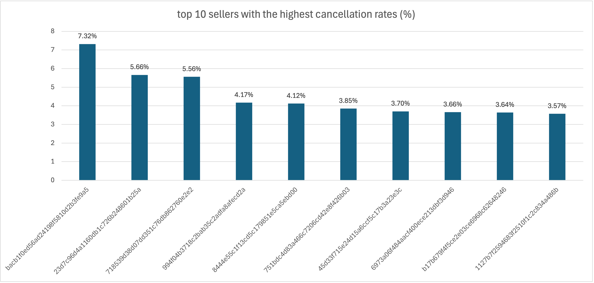

**Cancellation rate by order value (price quintile).**

```sql
-- Cancellation rate by total-payment quintile (1 = cheapest, 5 = priciest)
SELECT bucket,
       (SUM(CASE WHEN o.order_status = 'canceled' THEN 1 ELSE 0 END) / COUNT(*)) * 100 AS cancellation_rate
FROM (
    SELECT order_id, SUM(payment_value) AS sum_payment_value,
           NTILE(5) OVER (ORDER BY SUM(payment_value)) AS bucket
    FROM order_payments
    GROUP BY order_id
) sub
JOIN orders o ON o.order_id = sub.order_id
GROUP BY bucket;
```

| Price bucket (R$) | Cancellation rate |
| --- | --- |
| 0 – 54.49 | 0.63% |
| 54.49 – 85.52 | 0.55% |
| 85.52 – 128.73 | 0.57% |
| 128.73 – 202.76 | 0.53% |
| 202.76 – 13,664.08 | 0.86% |

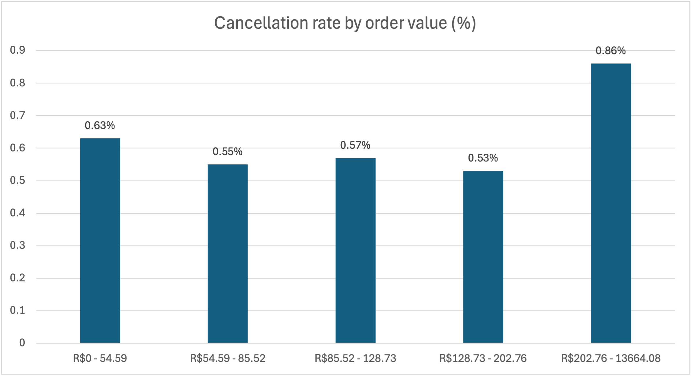

**Delivery timing accuracy:**

```sql
-- Average gap between estimated and actual delivery date
-- (positive = delivered early, negative = late)
SELECT ROUND(AVG(total_days), 2) AS avg_days_estimate_vs_actual
FROM (
    SELECT order_id, order_estimated_delivery_date, order_delivered_customer_date,
           TIMESTAMPDIFF(DAY, order_delivered_customer_date, order_estimated_delivery_date) AS total_days
    FROM orders
    WHERE order_delivered_customer_date IS NOT NULL
) sub;
```

| Metric | Value (days) |
| --- | --- |
| Average gap: estimated vs. actual delivery date | 10.96 |
| Average time: purchase to delivery | 12.09 |

**Seller delivery performance — finding the smallest buffer against the estimate.** Rather than ranking raw delivery speed (which conflates fast sellers with sellers whose customers simply live nearby), this ranks sellers by how much buffer they have against Olist's own delivery estimate - the metric that actually shows if they keep their promise. Restricted to single-seller orders with more than 40 total orders.

```sql
-- Sellers with the smallest average buffer vs. the estimated delivery date
-- (ascending order — smallest/most negative values first = closest to or past the estimate)
SELECT seller_id, AVG(total_days) AS avg_days_estimate_vs_actual, COUNT(order_id) AS total_orders
FROM (...) sub
GROUP BY seller_id
HAVING COUNT(order_id) > 40
ORDER BY avg_days_estimate_vs_actual ASC
LIMIT 10;
```

| seller_id | Avg. buffer vs. estimate (days) | Total orders |
| --- | --- | --- |
| 2a1348e9...9d6b | **−2.71** | 45 |
| 54965bbe...41f52 | 2.64 | 72 |
| a49928bc...b4ca5 | 3.46 | 93 |
| ede0c036...be73d | 3.47 | 43 |
| d13e50ea...5d8cfc | 3.70 | 66 |
| d20b021d...a48ea64b | 3.75 | 73 |
| 8e6d7754...da59eba | 3.84 | 77 |
| 6973a06f...dbf3d946 | 5.06 | 77 |
| cac4c8e7...c1a2e4af | 5.38 | 69 |
| e5a34388...395273d8e | 5.65 | 213 |

Against a platform average buffer of 10.96 days, all ten of these sellers are running noticeably tighter than typical. The top seller (`2a1348e9...`) is delivering 2.71 days **after** its own estimated delivery date on average.

**Freight cost vs. weight, controlled for distance.**

```sql
-- Freight cost by weight bucket, same-state vs. different-state shipping
SELECT weight_bucket, same_state_flag, COUNT(*) AS number_of_orders,
       AVG(freight_value) AS avg_freight_value, AVG(price) AS avg_price,
       AVG(freight_value / price) AS avg_freight_to_price_ratio
FROM (...) sub
GROUP BY weight_bucket, same_state_flag
ORDER BY weight_bucket;
```

This analysis was controlled for distance by grouping orders by same-state vs. different-state shipping. This was because freight cost depends heavily on distance, so without controlling for it, any difference between weight buckets could just reflect distance instead of weight. Same-state vs. different-state is a rough proxy for distance, not exact - but it's enough to check whether the weight effect holds up once distance is accounted for.

| Weight bucket | Same state? | Orders | Avg. freight (R$) | Avg. price (R$) | Freight/price ratio |
| --- | --- | --- | --- | --- | --- |
| Light | No | 27,885 | 18.36 | 81.59 | **0.484** |
| Light | Yes | 16,905 | 9.98 | 65.07 | **0.312** |
| Medium | No | 21,533 | 20.31 | 120.31 | 0.301 |
| Medium | Yes | 11,710 | 11.99 | 95.25 | 0.234 |
| Heavy | No | 22,476 | 33.55 | 199.18 | 0.263 |
| Heavy | Yes | 12,141 | 19.73 | 167.50 | 0.185 |

---

#### Findings

- **What does the order status breakdown look like, and what share of orders are cancelled or unavailable?** 1.24% of all orders (1,234 of 99,441) are cancelled or unavailable.
- **Does the cancellation rate vary by price or seller?** Yes, on both cuts. By price, cancellation sits in a narrow 0.53–0.63% band across the bottom four quintiles, then jumps to **0.86%** in the top quintile (orders above R$202.76) - roughly 1.5x the average of the other four. By seller, the worst seller with a credible sample (≥35 orders) cancels **7.32%** of orders, well above what any of the bottom-quintile-driven rates would suggest. This points to some seller-specific risk on top of the price effect, not instead of it.
- **On average, how far off are actual delivery dates from the estimate?** Orders are delivered **10.96 days earlier than the estimated date** on average, and take **12.09 days** from purchase to delivery. Olist's estimates carry a wide built-in buffer - which is useful context for interpreting the seller-level ranking below, since even "slower" sellers are usually still well inside that buffer.
- **Which sellers deliver fastest and slowest, among sellers with a meaningful order volume?** This was reframed as a 'buffer' against the estimate rather than raw speed. Among the sellers with >40 orders, the tightest-running seller averages **2.71 days past its own estimated delivery date.** The rest of the bottom 10 still deliver early, but with 2–6 days of buffer versus the platform's ~11-day average, meaning they have far less margin if anything goes wrong.
- **Do small or light orders pay disproportionately high freight relative to distance?** Yes. Light orders have the highest freight-to-price ratio in both distance conditions — **0.48** for different-state shipments and **0.31** for same-state, compared to 0.26–0.30 for heavy orders and medium orders in between. Controlling for distance mattered: different-state shipments consistently show a roughly 29–55% higher freight-to-price ratio than same-state shipments within every weight bucket, confirming distance is a real confound and not just noise. But, even after controlling for it, light items are structurally the most freight-expensive relative to their price.


### ⭐ Customer Satisfaction

#### Methodology

**Review score distribution:**

```sql
-- Distribution of order review scores
SELECT review_score, COUNT(*) AS count
FROM order_reviews
GROUP BY review_score
ORDER BY count DESC;
```

| Review score | Count | Share |
| --- | --- | --- |
| 5 | 57,327 | 57.8% |
| 4 | 19,142 | 19.3% |
| 1 | 11,424 | 11.5% |
| 3 | 8,179 | 8.2% |
| 2 | 3,151 | 3.2% |

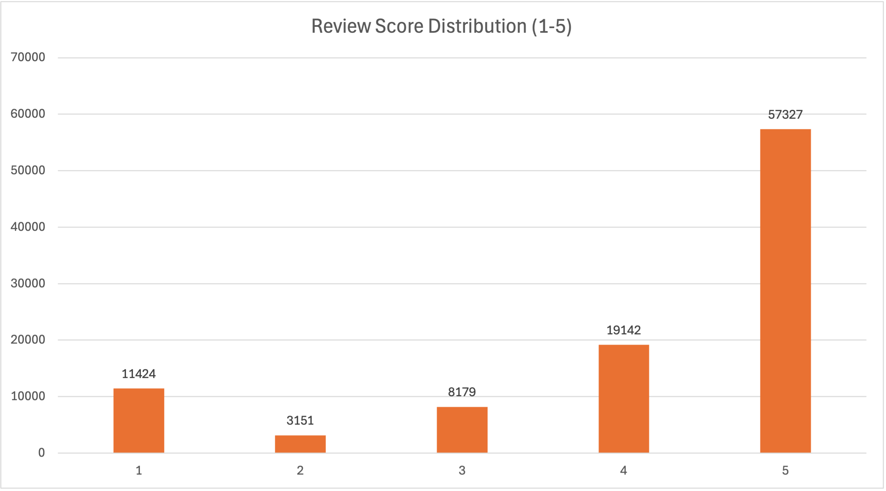

Review distribution is found to be heavily skewed toward 5-star, with a secondary spike at 1-star.

**Photo count & description length vs. review score.** Restricted to single-item orders (`COUNT(DISTINCT product_id) = 1`), since `product_photos_qty` and `product_description_length` live at the product level while `review_score` is order-level. Averaging across different products in a multi-item order would muddy the metric. Covers ~96% of orders (95,937 of ~99,441).

```sql
-- Average review score by photo count bucket
SELECT photos_bucket, AVG(review_score) AS average_review_score, COUNT(sub.order_id) AS number_of_orders
FROM (...) sub
GROUP BY photos_bucket
ORDER BY photos_bucket;
-- Full query: sql/05_customer_satisfaction.sql
```

| Photo count | Avg. review score | Orders |
| --- | --- | --- |
| Missing photo data | 3.960 | 1,391 |
| 1 photo | 4.110 | 46,480 |
| 2 photos | 4.150 | 18,720 |
| 3–4 photos | 4.148 | 18,351 |
| 5–6 photos | 4.179 | 8,199 |
| 7–20 photos | 4.151 | 2,796 |

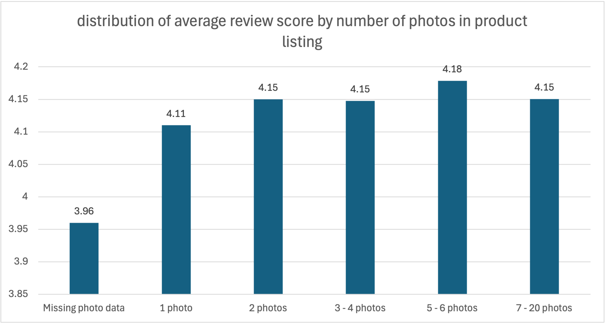

```sql
-- Average review score by description length bucket
SELECT description_length_bucket, AVG(review_score) AS average_review_score, COUNT(sub.order_id) AS number_of_orders
FROM (...) sub
GROUP BY description_length_bucket
ORDER BY description_length_bucket;
```

| Description length (characters) | Avg. review score | Orders |
| --- | --- | --- |
| Missing description | 3.959 | 1,393 |
| 0–250 | 4.103 | 13,011 |
| 250–400 | 4.132 | 15,223 |
| 400–800 | 4.140 | 31,925 |
| 800–1200 | 4.126 | 17,317 |
| 1200–3992 | 4.149 | 17,068 |

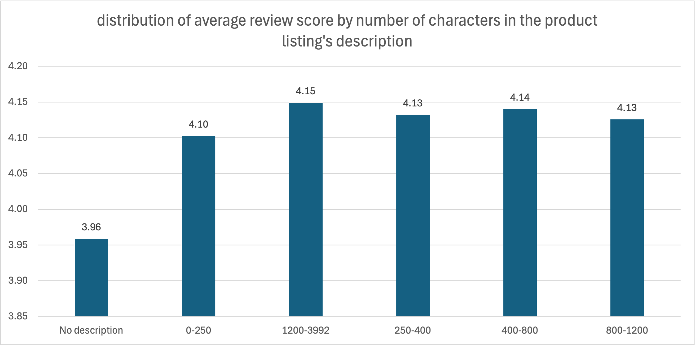

**Delivery status vs. review score.**

```sql
-- Average review score by delivery status
SELECT delivery_status, AVG(review_score) AS average_review_score, COUNT(order_id) AS total_orders
FROM (...) sub
GROUP BY delivery_status
ORDER BY average_review_score;
```

| Delivery status | Avg. review score | Orders |
| --- | --- | --- |
| Canceled or unavailable | 1.671 | 1,200 |
| Still in transit | 1.826 | 1,665 |
| Late | 2.567 | 7,701 |
| On time | 4.294 | 88,657 |

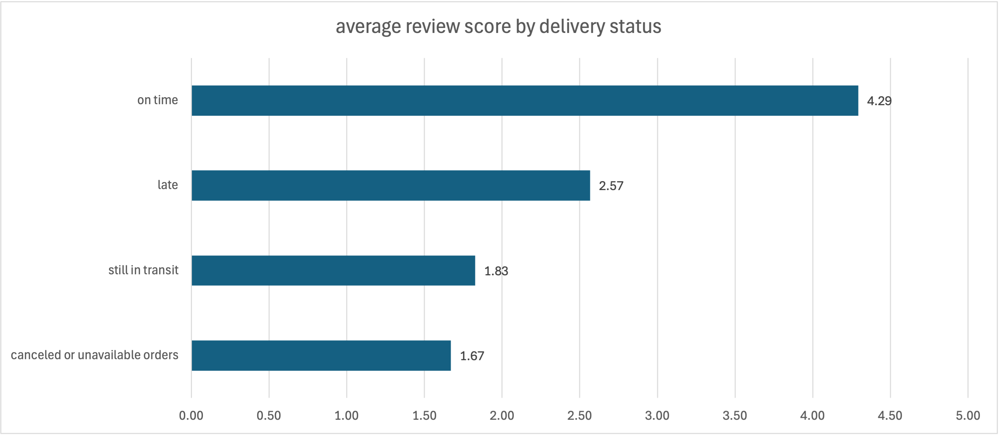

**Repeat purchase analysis.** Uses `customer_unique_id` throughout, not `customer_id` (which is generated per-order and structurally can't repeat).

```sql
-- Overall repeat purchase probability (%)
SELECT 100 * (
    SELECT COUNT(*) FROM (...) AS repeat_cust_list
) / (
    SELECT COUNT(DISTINCT customer_unique_id) FROM customers
) AS repeat_purchase_probability_percentage;
```

| Metric | Value |
| --- | --- |
| Total repeat customers | 2,997 |
| Total unique customers | 96,096 |
| Repeat purchase probability | 3.12% |
| Total revenue from repeat customers (incl. first order) | R$944,022.71 |

**Repeat purchase probability by customer state (top 10):**

| State | Repeat probability |
| --- | --- |
| AC | 5.19% |
| RO | 4.17% |
| RJ | 3.40% |
| MT | 3.31% |
| GO | 3.28% |
| SP | 3.22% |
| RS | 3.16% |
| MG | 3.00% |
| AL | 2.99% |
| DF | 2.99% |

**Repeat purchase probability by first-purchase category (top 10):**

| Category | Repeat probability |
| --- | --- |
| diapers_and_hygiene | 14.71% |
| la_cuisine | 14.29% |
| arts_and_craftmanship | 13.64% |
| home_appliances | 13.41% |
| fashion_childrens_clothes | 12.50% |
| fashio_female_clothing | 9.09% |
| furniture_bedroom | 8.74% |
| furniture_mattress_and_upholstery | 8.11% |
| fashion_underwear_beach | 7.81% |
| fashion_bags_accessories | 7.00% |

---

#### Findings

- **What does the distribution of review scores look like?** Heavily skewed positive: 57.8% of orders are rated 5 stars, with a smaller but real 11.5% spike at 1 star. Ratings 2–4 combined make up less than a third of all reviews. This skew matters for interpreting every other finding below. A 0.1–0.2 point average difference between buckets is a real but modest shift against this backdrop, not a dramatic one.
- **Are photo count and description length associated with review score, and which has the stronger relationship?** Neither shows a meaningful association. Among buckets with actual data, review scores stay within a narrow band - 4.110 to 4.179 for photo count (spread of 0.069) and 4.103 to 4.149 for description length (spread of 0.046). So, photo count only has a marginally stronger relationship. The more interesting signal is the **missing-data bucket**: orders where the product had no photo or description data at all scored noticeably lower (~3.96) than every populated bucket. That could however be a proxy for incomplete or lower-quality product listings generally, not evidence that photo count or description length themselves drive satisfaction.
- **Are late deliveries associated with lower review scores?** Yes, by far the strongest relationship in this section. On-time orders average 4.294; late orders drop to 2.567 - a 1.7-point fall on a 5-point scale. Orders still in transit or canceled / unavailable score even lower (1.826 and 1.671), which makes sense: those customers are reviewing an order they haven't actually received, not just a late one.
- **What share of customers make a repeat purchase, and does that likelihood vary by customer state or by the category of their first purchase?** Only 3.12% of customers (2,997 of 96,096) ever make a second purchase - the large majority of Olist's customer base is one-time buyers. That said, repeat customers aren't negligible in value: they generated R$944,022.71 in total revenue including their first order.  By state, repeat rates range from 2.99% to 5.19% among the top 10 - AC and RO stand out, though both are lower-population states, so a small-sample effect is plausible and not yet ruled out. By first-purchase category, rates range far more widely (7.00% to 14.71%). The data shows that customers which ordered a product within the category of 'diapers and hygiene', 'la cuisine', and 'arts and craftsmanship' are most likely to repurchase.

---

## 🛠️ How to Use This Project

1. **Clone the repo** and open it in your SQL client of choice (all queries were written and tested in MySQL / MySQL Workbench).
2. **Download the raw CSVs** from the Kaggle dataset — they aren't included in this repo, so save them locally and note the file path.
3. **Run `sql/01_database_setup.sql`** to create the schema, tables, and relationships (PKs/FKs).
4. **Run `sql/02_data_loading.sql`** to load the CSVs into the tables — update the file paths in the `LOAD DATA INFILE` statements first to point at wherever you saved the CSVs in step 2.
5. **Run the three analysis scripts** in any order — `03_GMV_order_volume_trends.sql`, `04_delivery_logistics.sql`, `05_customer_satisfaction.sql` — each is self-contained and commented section by section.
6. **Cross-reference results** against the tables and findings in this README to follow the reasoning behind each query.

---

## 🔗 Connect

If you’d like to discuss this project or data analytics roles, feel free to connect with me on [LinkedIn](http://www.linkedin.com/in/nicolascrifasi).
